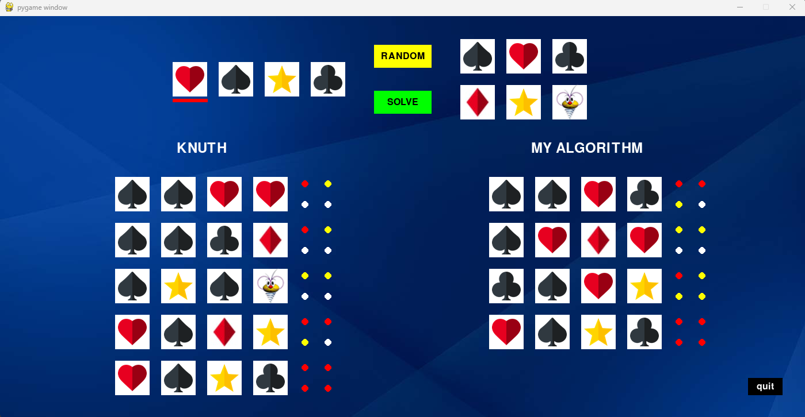

# Slagalica Puzzle Game AGENT

This Mastermind puzzle game is a Python implementation using the Pygame library. It challenges players to solve a code by guessing the correct combination of symbols within a limited number of attempts.
Slagalica is Mastermind adaptation with 4 fields and 6 colors.

## Features
- **Interactive GUI**: Utilizes Pygame for an engaging graphical interface.
- **Solving Algorithms**: Includes different solving algorithms Knuth's algorithm and my algorithm(both solve problem in less than 5 guesses)

## Getting Started
1. Clone the repository.
2. Ensure you have Python 3.x installed.
3. Install Pygame: `pip install pygame`.
4. Run the game: `python main.py`.

## Game Controls
- Use the mouse to interact with buttons.
- Click the "RANDOM" button to generate a new random solution.
- Click the "SOLVE" button to activate solving algorithms.
- Click symbol buttons to input your guesses.

## Gameplay
- The goal is to guess the correct combination of symbols within a limited number of attempts.
- Comparation of two agents and guesses used for solving.

